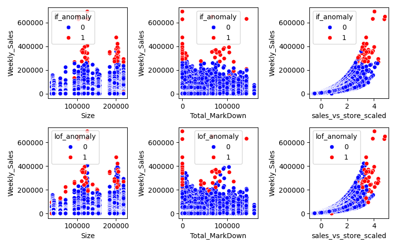
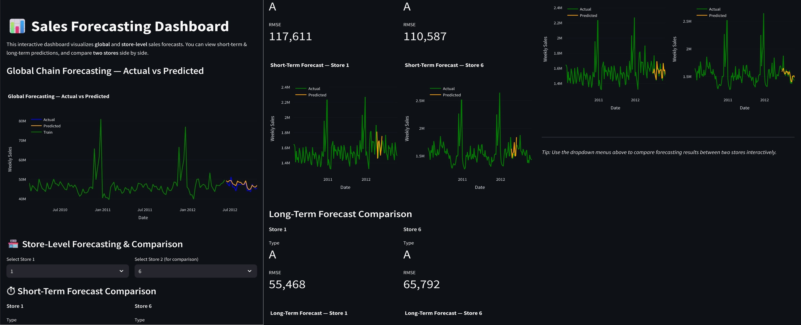

# CommerceSense 
## Data-to-Decision Retail Intelligence Pipeline

CommerceSense is an end-to-end Retail Intelligence and Forecasting System that transforms raw sales data into actionable insights — combining data engineering, machine learning, and business analytics in one cohesive pipeline.

It provides a full lifecycle of applied data science for retail, including:

 1. Data preprocessing and feature engineering

 2. Exploratory Data Analysis (EDA)

 3. Store and department segmentation

 4. Market basket analysis

 5. Anomaly detection

 6. Sales forecasting (short- and long-term)

 7. Streamlit app for interactive forecasting and analysis

 8. Error Analysis

## Repo Structure

```plaintext
Retail Analytics/
├── .git/                          # Git version control metadata
├── .gitattributes
├── .gitignore
├── .venv/                         # Local virtual environment (optional)
│
├── data/
│   ├── raw/
│   │   ├── features.csv           # Store-level macroeconomic and metadata features
│   │   ├── sales.csv              # Weekly sales by store and department
│   │   └── stores.csv             # Store type, size, and location information
│   │
│   └── processed/
│       ├── cleaned_data.csv       # Cleaned dataset used for analysis
│       └── preprocessed_data.csv  # Final processed dataset ready for modeling
│
├── notebooks/
│   ├── EDA.ipynb
│   ├── Store Segmentation.ipynb
│   ├── Department-Segmentation.ipynb
│   ├── Market-Basket Analysis.ipynb
│   ├── Anomaly-Detection.ipynb
│   ├── Longterm-Demand-Forecasting.ipynb
│   ├── shortterm-Demand-Forecasting.ipynb
│   ├── global-model.ipynb
│   └── Error Analysis.ipynb
│
├── src/
│   ├── preprocess.py                     # Data preprocessing and feature creation
│   ├── global-forecasting-model.py       # Global forecasting model pipeline
│   ├── longterm-demand-forecasting.py    # Store-level long-term forecasting
│   ├── shortterm-demand-forecasting-copy.py # Short-term forecasting models
│   ├── dept_segmentation.py              # Department clustering logic
│   ├── store_segmentation.py             # Store-level segmentation
│   ├── marketbasket.py                   # Association rule mining pipeline
│   ├── anomaly_detection.py              # Time-series anomaly detection
│   └── utils.py                          # Common helper functions (if present)
│
├── results/
│   ├── global_model_metrics.csv           # Model performance summary
│   ├── top_rules.csv                      # Market basket rules (support/confidence/lift)
│   ├── Clustering using various methods.png
│   ├── Features for different clusters.png
│   ├── Longterm forecasting using LightGBM for store 10.png
│   ├── Longterm forecasting using XGBoost for store 10.png
│   ├── STL Decomposition example.png
│   └── (Other plots and forecast outputs omitted for brevity)

│
├── saved_models/
│   ├── Chain/                          # Aggregated/global models
│   ├── Store/                          # Per-store models (LightGBM, Prophet, etc.)
│   └── short-term/Store/               # Short-term per-store models
│
├── forecasting-app.py                  # Streamlit dashboard for interactive forecasting
├── requirements.txt                    # Python dependencies
└── README.md                           # This documentation
```

## **Problem Statement**

Retailers face three major challenges:

**1. Demand forecasting:** Predicting store-level weekly sales with high accuracy.

**2. Behavioral segmentation:** Understanding performance variation across stores and departments.

**3. Cross-sell discovery:** Identifying co-purchased product categories to improve promotions.

This project provides a unified analytics workflow to address all three using statistical and machine learning approaches.

## **Data Flow & Methodology**

### **1. Data Preprocessing:**</u>

Merge sales, store, and feature datasets.

Handle missing values, outliers, and anomalies.

Create lag and rolling-window features for temporal modeling.

Generate holiday and event-based dummy variables.

### **2. Exploratory Data Analysis (EDA):**

Analyze sales trends and seasonality by store and department.

Visualize macroeconomic effects (CPI, fuel price, unemployment).

Identify high-growth vs stagnant departments.

### **3. Segmentation:**

Used Silhouette and Elbow methods for optimal cluster selection.

Store and Dept segmentation via K-Means and Agglomerative.

#### Segmentation Insights

Cluster 0 (Large & Volatile Stores)

- High median sales but strong seasonality and higher volatility (4–6% anomalies).

- Weak markdown correlation → promotions have limited impact.

- Lower sales per store size → under-utilized space.
   Key Actions:
- Focus forecasting on seasonal peaks, cut blanket discounts, and optimize product mix for better space efficiency.

Cluster 1 (Small & Stable Stores)

- Lower sales but highly stable, predictable demand.

- Stronger markdown correlation → promotions work well here.

- Higher sales per size → efficient space use.
 Key Actions:
Use targeted markdowns, maintain lean inventory, and explore expansion or pilot launches in these efficient stores.

### **4. Market Basket Analysis**

Implemented Apriori algorithm to find association rules.

Used metrics: support, confidence, and lift.
  
- Most rules cluster at high confidence (>0.9) and moderate support (0.3–0.6), meaning several product pairs are reliably co-purchased, though not necessarily across all transactions.
 #### Business Implication:
- Focus cross-sell efforts on these high-confidence, mid-support rules — they represent consistent but not over-saturated co-purchases (ideal for bundle promotions).


- Focused on top 10 rules with high lift for actionable insights.
#### Top 10 Association Rules (by Lift)
| Rank | Antecedents | Consequents | Support | Confidence | Lift |
|------|--------------|-------------|----------|-------------|------|
| 1 | 37 | 96, 58 | 0.3128 | 0.7814 | **1.7310** |
| 2 | 37 | 49, 58 | 0.3680 | 0.9193 | **1.6044** |
| 3 | 37 | 96, 49 | 0.3215 | 0.8032 | **1.5392** |
| 4 | 37 | 49, 54 | 0.3503 | 0.8750 | **1.5313** |
| 5 | 37 | 58, 94 | 0.3618 | 0.9037 | **1.5200** |
| 6 | 37 | 49, 94 | 0.3767 | 0.9410 | **1.5157** |
| 7 | 37 | 80, 49 | 0.3880 | 0.9693 | **1.5136** |
| 8 | 37 | 96, 54 | 0.3038 | 0.7589 | **1.5134** |
| 9 | 37 | 49, 98 | 0.3818 | 0.9538 | **1.4854** |
| 10 | 37 | 49, 93 | 0.3890 | 0.9717 | **1.4831** |

| Observation                                 | Business Interpretation                                                                                                                |
| ------------------------------------------- | -------------------------------------------------------------------------------------------------------------------------------------- |
| High lift (1.73) for {37 → 96, 58}          | Strong **triplet dependency** — indicates frequent joint purchase patterns, suitable for *bundle-based discounts*.                     |
| Repeated appearance of {37, 49, 58, 94, 96} | Suggests a **core product ecosystem** — optimizing shelf placement or recommendation engine around these can drive basket size.        |
| Confidence >0.9 in most rules               | Customers show **habitual pairing** behavior, ideal for loyalty and repeat-purchase marketing.                                         |
| Moderate support (~0.35)                    | These combinations aren’t universal, so **target promotions selectively** to stores or segments where these co-purchases are frequent. |


  
Insight:
Department 37 acts as a central hub, frequently co-occurring with 49, 58, 94, and 96 — these edges also have the highest lift.
Business Implication:
- Create bundled offers around Department 37 items (it triggers multiple complementary purchases).
- Position these departments adjacently in stores or cross-promote online (e.g., “Customers buying from Dept 37 also purchase from 49 and 58”).


Product category 37 is the anchor department for cross-selling opportunities. Most high-lift combinations involve 49, 58, 94, and 96, making them strong candidates for co-marketing, joint offers, and adjacency planning.
These insights directly guide planogram optimization, personalized recommendations, and campaign targeting.

### **5. Anomaly Detection**

Using Isolation Forest and Local Outlier Factor


Red points indicate anomalous sales weeks flagged by Isolation Forest (top) and Local Outlier Factor (bottom).
LOF is better at detecting local outliers compared to Isolation Forest

Decomposed sales series using STL.

The top panel decomposes weekly sales into trend, seasonality, and residuals.
The bottom panel overlays detected anomalies (red = statistical outliers, green = rolling-window anomalies).
Spikes in residuals coincide with red markers, confirming the model’s sensitivity to sharp, non-seasonal fluctuations.
  
### **6.Forecasting**

Models: LightGBM, XGBoost, Prophet, and hybrid ensembles.

| Metric | Value |
|---------|--------|
| RMSE | 4779.57 |
| R² | 0.9526 |
| Median RMSE (across stores) | ~4800 |


- LightGBM and XGBoost outperform Prophet for long-term horizons.
- Longterm forecast
  

-Shortterm Forecast

  

### **7. Forecasting app**
  

### **8. Error Analysis**


Model diagnostics were performed to assess forecast robustness and model performance and comparision

[See full notebook →](notebooks/Error%20Analysis.ipynb)


## **Run Instructions**
 **Step 1: Environment Setup**
- `python -m venv .venv`
- `source .venv/bin/activate`  # Windows: `.venv\Scripts\activate`
- `pip install -r requirements.txt`

 **Step 2: Preprocess Data**
- `python src/preprocess.py`

 **Step 3: Run Pipelines**
- `python src/longterm-demand-forecasting.py`
- `python src/shortterm-demand-forecasting-copy.py`
- `python src/marketbasket.py`
- `python src/store_segmentation.py`
- `python src/anomaly_detection.py`

 **Step 4: Launch Forecasting Dashboard**
- `streamlit run forecasting-app.py`

## **Project Status**

Current phase completed — end-to-end retail analytics pipeline implemented. Further improvements (error analysis & pipeline refactor) planned after completing other projects.


---

## 👩‍💻 Created By

**Aparna Praturi**  
PhD (Physics) • AI & ML Engineer  
📍 Focus: AI for Retail, BioPharma, and Scalable ML Systems  

🔗 Connect with me:  
- [GitHub](https://github.com/Aparna-Praturi)  
- [LinkedIn](https://www.linkedin.com/in/aparna-praturi/)  
- [Email](mailto:aparnaps777@gmail.com)

---

##  License

This project is licensed under the **MIT License** — you are free to use, modify, and distribute it,  
provided that proper credit is given.


CommerceSense is an end-to-end Retail Intelligence and Forecasting System that transforms raw sales data into actionable insights — combining data engineering, machine learning, and business analytics in one cohesive pipeline.


