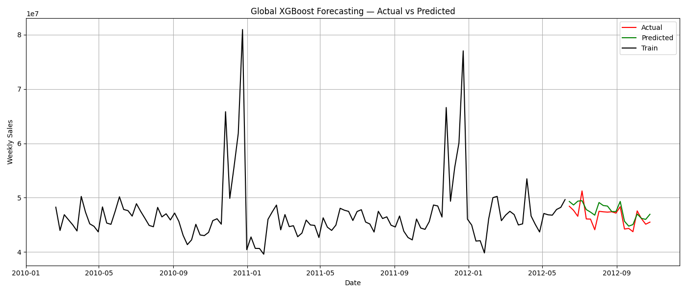

This repository implements a comprehensive **Retail Analytics pipeline** that spans the full lifecycle of data science in retail — from raw data to actionable insights and deployment.

It combines:

 1. Data preprocessing and feature engineering

 2. Exploratory Data Analysis (EDA)

 3. Store and department segmentation

 4. Market basket analysis

 5. Anomaly detection

 6. Sales forecasting (short- and long-term)

 7. Streamlit app for interactive forecasting and analysis

```plaintext
Retail Analytics/
├── .git/                          # Git version control metadata
├── .gitattributes
├── .gitignore
├── .venv/                         # Local virtual environment (optional)
│
├── data/
│   ├── raw/
│   │   ├── features.csv           # Store-level macroeconomic and metadata features
│   │   ├── sales.csv              # Weekly sales by store and department
│   │   └── stores.csv             # Store type, size, and location information
│   │
│   └── processed/
│       ├── cleaned_data.csv       # Cleaned dataset used for analysis
│       └── preprocessed_data.csv  # Final processed dataset ready for modeling
│
├── notebooks/
│   ├── EDA.ipynb
│   ├── Store Segmentation.ipynb
│   ├── Department-Segmentation.ipynb
│   ├── Market-Basket Analysis.ipynb
│   ├── Anomaly-Detection.ipynb
│   ├── Longterm-Demand-Forecasting.ipynb
│   ├── shortterm-Demand-Forecasting.ipynb
│   ├── global-model.ipynb
│   └── Error Analysis.ipynb
│
├── src/
│   ├── preprocess.py                     # Data preprocessing and feature creation
│   ├── global-forecasting-model.py       # Global forecasting model pipeline
│   ├── longterm-demand-forecasting.py    # Store-level long-term forecasting
│   ├── shortterm-demand-forecasting-copy.py # Short-term forecasting models
│   ├── dept_segmentation.py              # Department clustering logic
│   ├── store_segmentation.py             # Store-level segmentation
│   ├── marketbasket.py                   # Association rule mining pipeline
│   ├── anomaly_detection.py              # Time-series anomaly detection
│   └── utils.py                          # Common helper functions (if present)
│
├── results/
│   ├── global_model_metrics.csv           # Model performance summary
│   ├── top_rules.csv                      # Market basket rules (support/confidence/lift)
│   ├── Clustering using various methods.png
│   ├── Features for different clusters.png
│   ├── Longterm forecasting using LightGBM for store 10.png
│   ├── Longterm forecasting using XGBoost for store 10.png
│   ├── STL Decomposition example.png
│   └── (Other plots and forecast outputs omitted for brevity)

│
├── saved_models/
│   ├── Chain/                          # Aggregated/global models
│   ├── Store/                          # Per-store models (LightGBM, Prophet, etc.)
│   └── short-term/Store/               # Short-term per-store models
│
├── forecasting-app.py                  # Streamlit dashboard for interactive forecasting
├── requirements.txt                    # Python dependencies
└── README.md                           # This documentation
```

**Problem Statement**

Retailers face three major challenges:

**1. Demand forecasting:** Predicting store-level weekly sales with high accuracy.

**2. Behavioral segmentation:** Understanding performance variation across stores and departments.

**3. Cross-sell discovery:** Identifying co-purchased product categories to improve promotions.

This project provides a unified analytics workflow to address all three using statistical and machine learning approaches.

**Data Flow & Methodology**

**1. Data Preprocessing:**

Merge sales, store, and feature datasets.

Handle missing values, outliers, and anomalies.

Create lag and rolling-window features for temporal modeling.

Generate holiday and event-based dummy variables.

**2. Exploratory Data Analysis (EDA):**

Analyze sales trends and seasonality by store and department.

Visualize macroeconomic effects (CPI, fuel price, unemployment).

Identify high-growth vs stagnant departments.

**3. Segmentation:**

Used Silhouette and Elbow methods for optimal cluster selection.

Store and Dept segmentation via K-Means and Agglomerative.


**4. Market Basket Analysis**

Implemented Apriori algorithm to find association rules.

Used metrics: support, confidence, and lift.

Focused on top 10 rules with high lift for actionable insights.
### Top 10 Association Rules (by Lift)
| Rank | Antecedents | Consequents | Support | Confidence | Lift |
|------|--------------|-------------|----------|-------------|------|
| 1 | 37 | 96, 58 | 0.3128 | 0.7814 | **1.7310** |
| 2 | 37 | 49, 58 | 0.3680 | 0.9193 | **1.6044** |
| 3 | 37 | 96, 49 | 0.3215 | 0.8032 | **1.5392** |
| 4 | 37 | 49, 54 | 0.3503 | 0.8750 | **1.5313** |
| 5 | 37 | 58, 94 | 0.3618 | 0.9037 | **1.5200** |
| 6 | 37 | 49, 94 | 0.3767 | 0.9410 | **1.5157** |
| 7 | 37 | 80, 49 | 0.3880 | 0.9693 | **1.5136** |
| 8 | 37 | 96, 54 | 0.3038 | 0.7589 | **1.5134** |
| 9 | 37 | 49, 98 | 0.3818 | 0.9538 | **1.4854** |
| 10 | 37 | 49, 93 | 0.3890 | 0.9717 | **1.4831** |

  
  

**5. Anomaly Detection**

Using Isolation Forest and Local Outlier Factor

Decomposed sales series using STL.

  
**6.Forecasting**

Models: LightGBM, XGBoost, Prophet, and hybrid ensembles.

| Metric | Value |
|---------|--------|
| RMSE | 4779.57 |
| R² | 0.9526 |
| Median RMSE (across stores) | ~4800 |




- LightGBM and XGBoost outperform Prophet for long-term horizons.
- Longterm forecast
  

-Shortterm Forecast

  

**7. Forecasting app**
[App_screen_grab](results/app.pdf)  

** 8. Error Analysis**


Model diagnostics were performed to assess forecast robustness and model performance and comparision
[See full notebook →](notebooks/Error%20Analysis.ipynb)


**Run Instructions**
Step 1: Environment Setup
`python -m venv .venv`
`source .venv/bin/activate`  # Windows: `.venv\Scripts\activate`
`pip install -r requirements.txt`

Step 2: Preprocess Data
`python src/preprocess.py`

Step 3: Run Pipelines
`python src/longterm-demand-forecasting.py`
`python src/shortterm-demand-forecasting-copy.py`
`python src/marketbasket.py`
`python src/store_segmentation.py`
`python src/anomaly_detection.py`

Step 4: Launch Forecasting Dashboard
`streamlit run forecasting-app.py`


